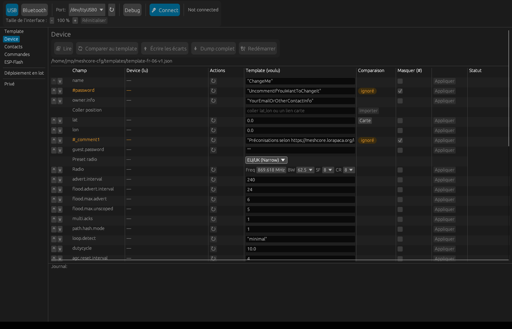
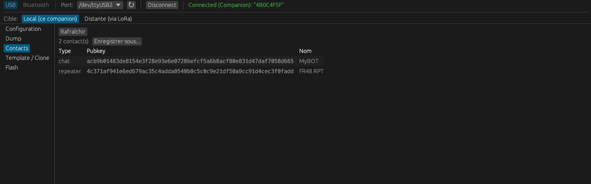
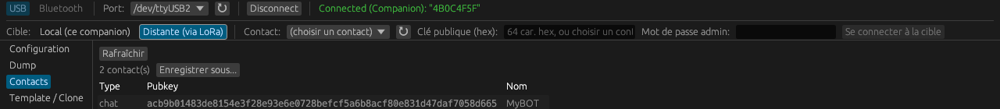

# meshcore-cfg

*[🇫🇷 Version française](README.md)*

A tool (Rust) to configure [MeshCore](https://meshcore.io/) devices —
repeater, room-server, sensor, **and companion** — with a graphical
interface for everyday use, and a full CLI for advanced/scriptable
usage. Applies complete configuration templates, manages the region
tree, manages the ACL (admin/guest permissions), configures a remote
companion over another companion on the LoRa mesh, and flashes ESP32
firmware natively.

> **Source code**: not published yet — this repo only distributes
> precompiled binaries (see [Releases](https://github.com/jmpuch/meshcore-cfg/releases)
> for details on each version). If there's enough interest, the source
> will follow.

## Installation

Download the binary for your system from the
[Releases](https://github.com/jmpuch/meshcore-cfg/releases) page:

- **Linux** (x86_64): `meshcore-cfg-linux-x86_64`
- **Windows** (x86_64): `meshcore-cfg-windows-x86_64.exe` —
  self-contained, no extra DLL to install
- **macOS** (Intel + Apple Silicon, universal binary):
  `meshcore-cfg-macos-universal`

```bash
# Linux/macOS: make the binary executable
chmod +x meshcore-cfg-linux-x86_64   # or -macos-universal
```

**Double-click the binary (or run it with no arguments) to open the
graphical interface.** That's the normal entry point for most use
cases — the CLI (command line, with arguments) is still available
alongside it for advanced usage, see below.

**Gatekeeper (macOS)**: since the binary isn't signed/notarized with an
Apple developer account, macOS refuses to launch it on the first try
("can't be opened because it is from an unidentified developer"). Two
ways around it: **System Settings → Privacy & Security**, scroll down
to the blocked-file message and click *Open Anyway*; or from the
command line, once and for all:

```bash
xattr -d com.apple.quarantine ./meshcore-cfg-macos-universal
```

**Antivirus (Windows)**: an unsigned, freshly-published executable can
get flagged by some antivirus software — a common false positive for
this kind of tool (nothing to do with the code), tied to the lack of a
signature and the file's newness rather than actual suspicious
behavior. If it happens, adding an exception is enough; reporting it as
a false positive to your antivirus vendor helps get it fixed for
everyone.

## Getting started (graphical interface)

### 1. Plug in the device and pick a port

The device connects over USB (or, for a companion, can also be reached
over Bluetooth). Launch `meshcore-cfg` with no arguments: the screen
that opens offers a **USB**/**Bluetooth** choice, a port (or Bluetooth
name) picker, and a **Connect** button.

No need to say what kind of device it is (repeater, room-server, sensor,
or companion) — the program detects it automatically on connect.

**Finding your port** if the picker doesn't already show it:

- **Windows** — Device Manager → "Ports (COM & LPT)": the device
  typically shows up as `Silicon Labs CP210x USB to UART Bridge
  (COMx)` (or `CH340` depending on the board). If nothing shows up
  while the cable is plugged in, the CP210x driver is probably missing
  and needs installing manually (not always bundled with Windows by
  default).
- **Linux/macOS** — the ↻ button next to the port picker refreshes the
  list; the device shows up as `/dev/ttyUSB0` (Linux) or
  `/dev/tty.usbmodemXXXX`/`/dev/tty.usbserial-XXXX` (macOS).

### 2. Connect

Once the port is selected, click **Connect**. The status switches to
*Connecting…* then, once the device type is detected, to *Connected*
(in green), with the device type shown in parentheses (Sensor,
Repeater, Room Server, or Companion).



*(This screenshot also shows the automatic recall of the last template
used — see step 4 — even before any connection: that's expected, the
comparison updates as soon as a device is read.)*

### 3. The Configuration tab fills in by itself

As soon as the connection is established, every attribute of the device
is read automatically (no need to click "Refresh" first) — each row of
the table appears as it's read, rather than waiting for the whole
read to finish.


Each field gets its own row: the value currently read from the device,
a box to type a new value, and a **Set** button to write it. Fields
shown in orange are sensitive fields, or fields the loaded template
documents but leaves disabled (see below) — they stay visible but
never get applied until the `#` is removed from the file.

### 4. Compare against a template

The **Choose a template...** button loads a JSON configuration file
(see "Template format" below) and shows, for every field, the value
currently read **and** the value the template wants, side by side:

- **Green**: the value already matches the template — nothing to do.
- **Red**: it differs — that row's **Apply** button writes just that
  one field.
- **Orange**: a sensitive field (private key, channel secret...) or one
  deliberately disabled in the template (prefixed `#`) — never applied
  automatically, even by "Apply the whole template".

The **Apply the whole template** button, at the top, writes every
differing field at once (excluding disabled/sensitive ones). The last
template used is remembered automatically and reloaded the next time
the program starts.

## The tabs

- **Configuration** — described above: every attribute, comparison
  against a template, and (if the device has them) **ACL** and
  **Regions** sections below the main table, on the same principle
  (value read vs. template value, same coloring).
- **Dump** — a complete snapshot of the device's state as JSON, to save
  to a file.
- **Contacts** — the connected companion's own address book (adverts/
  DMs it has heard) — useful for finding the full public key of a
  remote device to control over LoRa (see below).

  

- **Template / Clone** — loads a file and offers a preview (dry-run)
  then a real application, independently of the Configuration tab
  (useful for testing a template without touching what's shown
  elsewhere).
- **Editor** — creates or edits a template file **without being
  connected to a device**. "New" starts with every known field already
  present, disabled (`#`) with a neutral placeholder value — a form to
  fill in rather than a blank page where you'd have to guess field
  names; "Load a template..." reopens an existing file to edit it. Each
  field can be toggled (`#`), edited, or deleted row by row, and new
  ones can be added. Table columns can be resized by dragging their
  border, and the chosen widths are remembered across launches. A
  **Regions** section below lets you build the hierarchy the same way
  (parent, flood allowed, home/default) — "New" starts it off with a
  disabled EU → Europe → FR example. Limited to `vars` + regions +
  device type for now (no ACL editing yet).
- **Commands** — paste a block of raw CLI commands (one per line, e.g. a
  meshcore.fr-style setup recipe) and run them all at once, in order.
  Blank lines and lines starting with `#` are skipped. A failing line
  (e.g. `reboot`/`clock sync`, which normally fail over a direct
  connection) doesn't stop the rest — each line's result and the final
  tally show up in the Journal.
- **Flash** — writes an already-merged `.bin` firmware (ESP32/ESP32-S3
  only for now — Heltec V2/V3/V4 and similar).

## Companion: configure it locally, or drive a remote target over LoRa

A companion (the device plugged in locally) can be configured
directly — name, coordinates, radio, TX power, custom variables —
that's **Local (this companion)** mode, active by default.

If this companion is physically in range of **another** MeshCore
device on the LoRa mesh (a repeater, room-server, or sensor), it can
also act as a relay to configure it remotely — **Remote (via LoRa)**
mode:



1. Pick a contact from the dropdown (already known to the companion —
   auto-refreshed on connect, or via the ↻ button), or type a public
   key manually.
2. Enter the target device's admin password.
3. **Connect to target** — this step is **slow** (a real LoRa radio
   round-trip, potentially tens of seconds): explicit text says so
   while waiting, rather than a silent spinner.

Once a target is active, **every** tab (Configuration, Dump, Template/
Clone) acts on it instead of the local companion — an orange "ACTIVE
TARGET: ..." banner stays visible at all times in the top bar,
whichever tab is open, so it's never unclear which device the next
change actually reaches.

**Important**: the target must already be a **known** contact of the
companion (it must have heard it advertise at least once) — otherwise
the connection fails with an explicit message rather than a raw error
code.

## macOS — specifics

- **Gatekeeper** and **`xattr`**: see the Installation section above.
- **Bluetooth**: the very first time an unsigned binary touches
  Bluetooth on macOS, the system blocks access (an immediate crash,
  before any clear error message has time to show) until permission is
  granted — **not to the binary itself**, but to the app that launched
  it (Terminal.app, iTerm, or your file manager if you double-click
  it). If Bluetooth mode stays unusable: **System Settings → Privacy &
  Security → Bluetooth**, and allow the app you're launching
  `meshcore-cfg` from (Terminal, iTerm2, Finder...). Restarting that
  app after granting permission is sometimes needed too.
- **Universal binary**: a single file runs natively on both Intel and
  Apple Silicon Macs, nothing to choose at install time.

## Advanced usage (command line)

Everything the graphical interface does is also available from the
CLI, plus scriptable scenarios (`region`, `acl`, `neighbors`, `raw`,
and the companion relay-to-target mode from the command line):

```bash
meshcore-cfg --port /dev/ttyUSB0 --version
```

### Two device families

- **Repeater / room-server / sensor** — the firmware's native text CLI
  (`get`/`set <var>`), over direct USB or relayed through a companion
  on the LoRa mesh for a remote device that isn't physically reachable.
- **Companion** — the device plugged in locally on `--port`, configured
  directly (name, coordinates, radio, TX power, custom variables)
  rather than only used as a relay to a remote target. `--comp` flag,
  a different binary protocol (never plain-text CLI), always local
  (never `--target`/`--password`).

Optional device-type check before any command —
`--rep`/`--room`/`--sens`/`--comp` — useful to avoid accidentally
applying a template to the wrong device:

```bash
meshcore-cfg --port /dev/ttyUSB0 --sens get name   # refuses if it isn't a sensor
meshcore-cfg --port /dev/ttyUSB0 --comp dump       # configures the companion itself
```

A template/dump file can also tag itself
(`"device_type": "sensor"`, or `"repeater"`/`"room_server"`/`"companion"`)
— `dump` does this automatically. Without an explicit flag, a tag still
triggers a live check (safety net); with a flag, the tag must match or
the application is refused before anything is sent.

### Quick usage

Once the port is identified, the first useful move: check a repeater
against the provided template **without changing anything** —
`--dry-run` computes and shows the difference but never sends anything
to the device:

```bash
meshcore-cfg --port /dev/ttyUSB0 apply-template templates/template-fr.json --dry-run
```

Empty output (`0 field(s) changed`) means it already matches the
template. Any `Would change ...` line shows exactly what differs, to
review before applying for real (same command, without `--dry-run`).

The template file is looked up as given first, then with the
`templates/` prefix added or stripped depending on the case —
`apply-template template-fr.json` works whether the file is right next
to the binary or in a `templates/` subfolder, no matter how you typed
the path.

Every `reading <field>...` line shows the value read right after it,
on the same line — handy to follow what's happening live, and to keep a
record: `2>&1 | Tee-Object -FilePath log.txt -Append` on PowerShell (or
`2>&1 | tee -a log.txt` on Linux/macOS) captures everything printed to
a file, accumulating history across multiple runs.

Other useful commands:

```bash
# Read a field
meshcore-cfg --port /dev/ttyUSB0 get name

# Write a field
meshcore-cfg --port /dev/ttyUSB0 set tx 20

# Back up a device's whole config (vars + ACL + regions, one file)
meshcore-cfg --port /dev/ttyUSB0 dump my-repeater

# Restore it (or reproduce it on another device)
meshcore-cfg --port /dev/ttyUSB0 clone my-repeater --dry-run
meshcore-cfg --port /dev/ttyUSB0 clone my-repeater

# Region management (flood-scoping tree, not the radio frequency plan)
meshcore-cfg --port /dev/ttyUSB0 region list

# Run a block of commands (e.g. a meshcore.fr-style recipe saved to a file)
meshcore-cfg --port /dev/ttyUSB0 batch recipe.txt
# or straight from stdin:
cat recipe.txt | meshcore-cfg --port /dev/ttyUSB0 batch

# ACL management (who can administer/read this repeater — direct serial only)
meshcore-cfg --port /dev/ttyUSB0 acl list
meshcore-cfg --port /dev/ttyUSB0 acl set-perm <64-hex-char-pubkey> admin

# Direct radio neighbors (what the device has actually heard over LoRa, not a contact book)
meshcore-cfg --port /dev/ttyUSB0 neighbors
# 4C371AF9   39m ago    SNR 12.5 dB

# The LOCAL companion's own address book — full public key of each contact
# (neighbors only returns 4 bytes, not enough for --target)
meshcore-cfg --port /dev/ttyUSB0 --comp contacts
# repeater 4c371af941e6ed679ac35c4adda0540b0c5c0c9e21df50a9cc91d4cec3f0fadd FR48 RPT

# Configure a remote device via a companion radio on the LoRa mesh
meshcore-cfg --port /dev/ttyUSB0 --transport companion \
  --target <64-hex-char-target-pubkey> --password <password> get name
```

`--help` on any command (or subcommand) gives the full option details.

**Warning**: a `*-dump.json` file contains your device's **private**
identity key (`prv.key`) in the clear — keep it somewhere safe, never
share or publish it (Git repo, forum, etc.).

#### Troubleshooting (`--debug`)

The `--debug` flag (mostly useful with `--transport companion`/`--comp`,
whose protocol has no request/response correlation ID — see `--help`)
traces every frame sent/received to stderr. Combined with redirecting
to a file, that gives a full, shareable trace when something's wrong:

```bash
meshcore-cfg --port /dev/ttyUSB0 --transport companion \
  --target <64-hex-char-target-pubkey> --password <password> \
  --debug get name > trace.log 2>&1
```

**Before sharing this file**: the login frame (`CMD_SEND_LOGIN`)
contains your `--password` in the clear, in the raw bytes — strip/mask
it before publishing or sending a `--debug` trace to anyone.

### Configuring a companion (`--comp`)

```bash
meshcore-cfg --port /dev/ttyUSB0 --comp get name
meshcore-cfg --port /dev/ttyUSB0 --comp set name "MyCompanion"
meshcore-cfg --port /dev/ttyUSB0 --comp set lat 44.85413
meshcore-cfg --port /dev/ttyUSB0 --comp set radio '{"freq":869.618,"bw":125,"sf":8,"cr":5}'
meshcore-cfg --port /dev/ttyUSB0 --comp set tx 20
meshcore-cfg --port /dev/ttyUSB0 --comp dump companion-backup
meshcore-cfg --port /dev/ttyUSB0 --comp clone companion-backup --dry-run
```

Known fields: `name`, `lat`, `lon`, `radio` ({freq,bw,sf,cr}, same
display units as on a repeater — MHz/kHz), `tx`, `multi.acks`,
`custom.<key>`. Never `--target`/`--password` with `--comp` (always
local, never relayed). `region`/`acl`/`neighbors`/`raw` don't apply to
a companion (binary protocol, no text CLI) — refused with an explicit
message.

### Flashing firmware (ESP32 only for now)

```bash
# Needs an already-merged binary (bootloader + partition table + app),
# the same artifact PlatformIO produces via:
#   pio run -e <env> -t mergebin   # -> .pio/build/<env>/firmware-merged.bin
meshcore-cfg --port /dev/ttyUSB0 flash firmware-merged.bin

# --erase: wipes the ENTIRE chip before writing, not just the bytes the
# image covers. A normal flash leaves everything outside bootloader+
# partitions+app untouched — so it preserves the device's existing
# identity (public/private key). --erase forces the firmware to
# regenerate a new identity on first boot: for a genuinely new device,
# or to deliberately rotate an identity — never routinely on a device
# whose identity/settings matter.
meshcore-cfg --port /dev/ttyUSB0 flash --erase firmware-merged.bin
```

Works on ESP32/ESP32-S3 boards (Heltec V2/V3/V4 and similar) —
automatic chip detection, nothing to specify. Not yet supported: nRF52
boards (Heltec T114, RAK4631/WisBlock, etc.), which use a completely
different flashing mechanism (Nordic serial DFU) — coming in a future
version.

## Template `templates/template-fr.json`

An example template included with this repo — common configuration
fields are listed, either active or documented-disabled (a `#` prefix
on the key: the value stays visible but isn't applied). Matches the
official MeshCore France community recommendations field by field,
including `dutycycle` (European LoRa duty-cycle compliance) and the
`eu → europe → fr` region hierarchy with `home`/`default` on `fr`.
Generic to all of France, not any one city: `lat`/`lon` are
deliberately `#`-disabled (example values) — remove the `#` and
replace them with your own coordinates before applying. Deliberately
ships without an admin password or ACL entry — see "Template format"
below if you want to add your own.

Duplicate it and adapt the active values to your site before applying
(at minimum `lat`/`lon`) — check what would change first with
`--dry-run` (CLI) or the Configuration tab's comparison (GUI). Once
applied (if the template touches regions), the official recommendation
also asks you to sync the clock and reboot — outside the scope of this
tool: `clock sync` does **not** work over a direct serial connection
(it always refuses with `"ERR: clock cannot go backwards"`, regardless
of the clock's actual state). Set the device's clock through your own
installation's usual mechanism (companion/MeshCore app), then reboot it
manually once the template has been applied.

Region changes don't survive a reboot without an explicit `region
save` (unlike every other field, persisted automatically on every
write) — `apply-template`/`clone` (CLI) and the "Apply all regions"
button (GUI) send it automatically whenever a region change was
actually applied.

### `templates/template-fr-idf.json` variant

Adapted for the Île-de-France community, based on
[wiki.mesh-idf.fr](https://wiki.mesh-idf.fr/fr/meshcore/regions_et_canaux)
( !! to verify !! — community source, not the official meshcore.fr
recommendation). Different region hierarchy: `eu` and `fr` both at the
root (no intermediate `europe` level), with `fr-idf` as a child of `fr`
and `default` on `fr`. `flood.max.advert`/`flood.max.unscoped` at `16`
instead of `8`/`5`. If you're switching from the national template to
this one on an already-configured device, see `--prune` below to clean
up the previous template's regions.

## Template format

A template is a JSON file with, either alone or combined:

```json
{
  "vars": { "name": "My Repeater", "tx": 20, "...": "..." },
  "acl": { "<64-hex-char-pubkey>": "admin" },
  "regions": { "fr": { "parent": "europe", "flood_allowed": true } },
  "home": "fr",
  "default": null,
  "device_type": "repeater"
}
```

- A key prefixed with `#` (in `vars`, `acl`, or `regions`) documents a
  value without applying it — handy for keeping a complete template as
  a reference while only touching a subset of fields. This same prefix
  is also what colors a row orange in the GUI's Configuration tab.
- `device_type` (optional) declares the expected device type
  (`repeater`/`room_server`/`sensor`/`companion`) — checked against the
  connected device before anything is applied.
- `apply-template` (CLI) accepts several files at once and
  auto-detects the content of each — no need to say whether it's a
  vars template, a region template, or both.
- **`apply-template`/the GUI are never destructive by default**: they
  only touch what the file mentions, never what it doesn't. When
  switching region templates (e.g. going from the national template to
  a regional variant with a different hierarchy), the previous
  template's regions that are no longer mentioned stay in place,
  orphaned. The `--prune` flag (CLI only for now) removes those
  leftovers (and nothing else):

  ```bash
  meshcore-cfg --port /dev/ttyUSB0 apply-template templates/template-fr.json --prune --dry-run
  meshcore-cfg --port /dev/ttyUSB0 apply-template templates/template-fr.json --prune
  ```

  `--prune` stays optional (off by default — the only destructive
  operation this tool has on repeaters/room-servers/sensors) —
  recommended as a reflex on every region template change, unless you
  know you want to keep manually-added regions on top.

## License

Free to use for now (shared among friends, no formal license yet — will
come with the source code publication).
