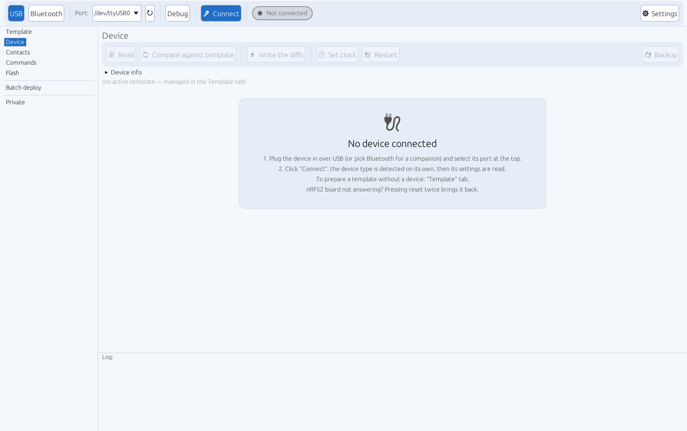
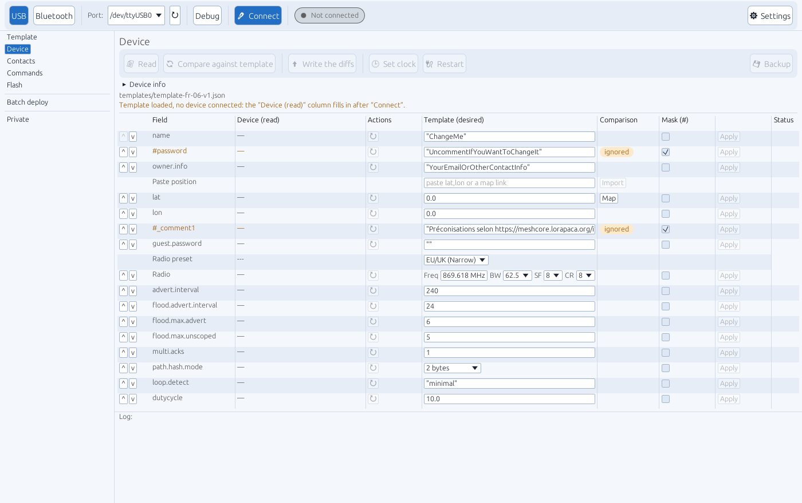
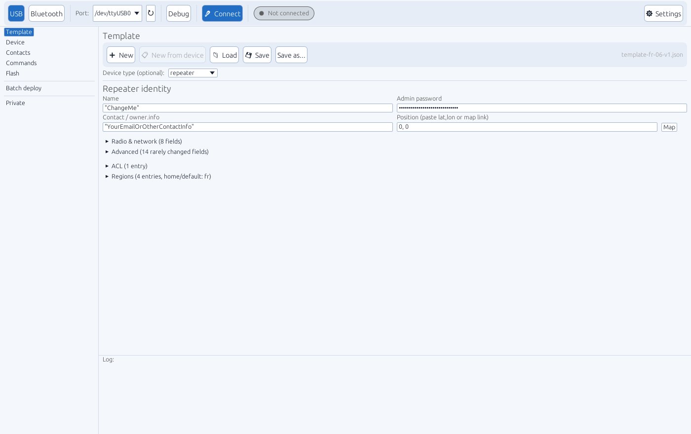
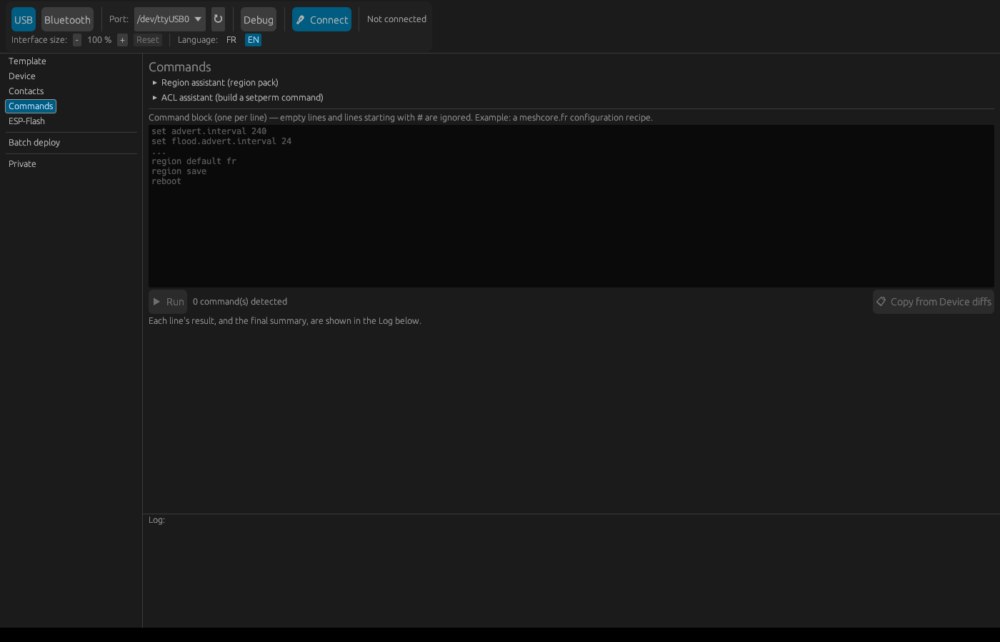
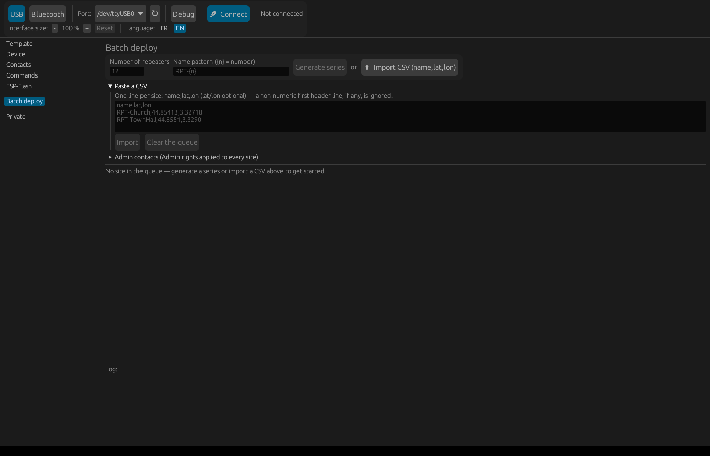
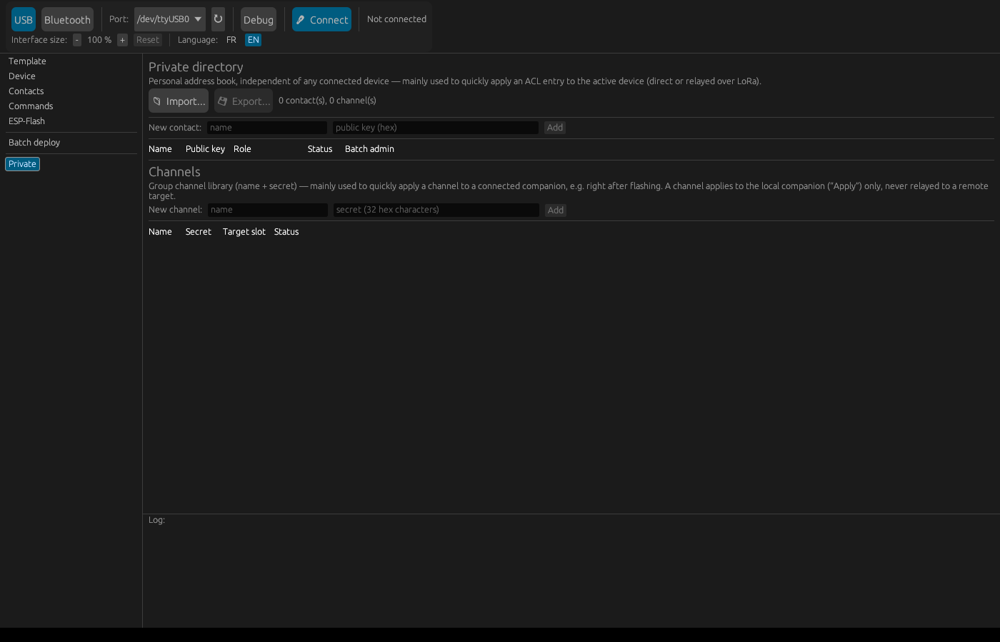

# meshcore-cfg

[](README.md)
[](README-en.md)

A tool (Rust) to configure [MeshCore](https://meshcore.io/) devices —
repeater, room-server, sensor, **and companion** (serial or Bluetooth) —
with a graphical interface for everyday use, and a full CLI for
advanced/scriptable usage. Applies complete configuration templates,
region assistant (44 countries), manages the ACL (admin/guest
permissions), configures a remote companion over another companion on
the LoRa mesh, and flashes firmware natively (ESP32 and nRF52,
including the OTAFIX bootloader update).

> **Source code**: not published yet — this repo only distributes
> precompiled binaries (see [Releases](https://github.com/jmpuch/meshcore-cfg/releases)
> for details on each version). If there's enough interest, the source
> will follow.

## Installation

Download the archive for your system from the
[Releases](https://github.com/jmpuch/meshcore-cfg/releases) page — each
one already bundles everything needed to get started: the binary, a
[`templates/`](templates/) folder (see "Compare to a template" below),
and a [`region-packs/`](region-packs/) folder (see "Region packs" below;
the program looks for `region-packs/france.json` next to itself by
default):

- **Linux** (x86_64): `meshcore-cfg-linux-x86_64.zip`
- **Windows** (x86_64): `meshcore-cfg-windows-x86_64.zip` — the binary
  inside is self-contained, no extra DLL to install
- **macOS** (Intel + Apple Silicon, universal binary):
  `meshcore-cfg-macos-universal.zip`

Extract the archive, then make the binary executable on Linux/macOS:

```bash
unzip meshcore-cfg-linux-x86_64.zip -d meshcore-cfg   # or -windows-x86_64 / -macos-universal
chmod +x meshcore-cfg/meshcore-cfg   # Linux/macOS only
```

**Double-click the extracted binary (or run it with no arguments) to open
the graphical interface.** That's the normal entry point for most use
cases — the CLI (command line, with arguments) is still available
alongside it for advanced usage, see below. The binary needs to stay in
the same folder as the `templates/`/`region-packs/` folders extracted
next to it for those two features to work — path resolution accepts a
file either next to the binary or in its subfolder, so if you move the
binary alone later, recreating a `templates/`/`region-packs/` subfolder
next to it is enough.

**Gatekeeper (macOS)**: since the binary isn't signed/notarized with an
Apple developer account, macOS refuses to launch it on the first try
("can't be opened because it is from an unidentified developer"). Two
ways around it: **System Settings → Privacy & Security**, scroll down
to the blocked-file message and click *Open Anyway*; or from the
command line, once and for all:

```bash
xattr -d com.apple.quarantine ./meshcore-cfg
```

**Antivirus (Windows)**: an unsigned, freshly-published executable can
get flagged by some antivirus software — a common false positive for
this kind of tool (nothing to do with the code), tied to the lack of a
signature and the file's newness rather than actual suspicious
behavior. If it happens, adding an exception is enough; reporting it as
a false positive to your antivirus vendor helps get it fixed for
everyone.

## Getting started (graphical interface)

### 1. Plug in the device and pick a port

The device connects over USB (or, for a companion, can also be reached
over Bluetooth). Launch `meshcore-cfg` with no arguments: the screen
that opens offers a **USB**/**Bluetooth** choice, a port (or Bluetooth
name) picker, and a **Connect** button.

No need to say what kind of device it is (repeater, room-server, sensor,
or companion) — the program detects it automatically on connect.

**Finding your port** if the picker doesn't already show it:

- **Windows** — Device Manager → "Ports (COM & LPT)": the device
  typically shows up as `Silicon Labs CP210x USB to UART Bridge
  (COMx)` (or `CH340` depending on the board). If nothing shows up
  while the cable is plugged in, the CP210x driver is probably missing
  and needs installing manually (not always bundled with Windows by
  default).
- **Linux/macOS** — the ↻ button next to the port picker refreshes the
  list; the device shows up as `/dev/ttyUSB0` (Linux) or
  `/dev/tty.usbmodemXXXX`/`/dev/tty.usbserial-XXXX` (macOS).

### 2. Connect

Once the port is selected, click **Connect**. The status pill, on the
right of the bar, goes from gray (*Not connected*) to orange
(*Connecting…*) then, once the device type is detected, to **green** with
its name and type (Sensor, Repeater, RoomServer or Companion). When a LoRa
target is active it turns **orange** and shows the target's name: you
always know which device you're acting on. Hover it for details.



*(Before any connection, the Device tab recalls the steps. If a template
was used last time, it's reloaded on its own and its table shows instead —
see step 4.)*

### 3. The Device tab fills in by itself

As soon as the connection is established, every attribute of the device
is read automatically (no need to click "📄 Read" first) — each row of
the table appears as it's read, rather than waiting for the whole
read to finish. The action bar at the top of the tab is grouped:
**📄 Read** and **🔄 Compare against template** | **⬆ Write the diffs** |
**🕒 Set clock** and **🔌 Restart**, and on the right a **💾 Backup**
menu (**Save the device…**, **Restore / clone from a backup…**). Progress (device detection,
field being read, contacts "x/total") shows in the connection bar at the
top. While nothing is connected, the tab shows a card with the steps.



*(Captured without an active connection — the table/ACL/Regions look the
same once connected, with the "Device (read)" column filled in too.)*

Each field gets its own row: the value currently read from the device in
the **Device (read)** column (not editable — it's a direct read from the
hardware), and the wanted value in **Template (desired)**, with an
**Apply** button to write it to the device. Fields shown in orange are
sensitive fields, or fields the loaded template documents but leaves
disabled (see below) — they stay visible but never get applied until the
`#` is removed from the file.

### 4. Compare against a template

A template is loaded or created in the **Template** tab ("New" or "Load
a template...", see below — there's only ever one active template,
shared between the two tabs). Back in **Device**, the **Compare against
template** button shows, for every field, the value currently read
**and** the value the template wants, side by side:

- **Green**: the value already matches the template — nothing to do.
- **Red**: it differs — that row's **Apply** button writes just that
  one field.
- **Orange**: a sensitive field (private key, channel secret...) or one
  deliberately disabled in the template (prefixed `#`) — never applied
  automatically, even by "Write the diffs".

The **⬆ Write the diffs** button, at the top, writes every differing
field at once (excluding disabled/sensitive ones) — its label shows the
pending count directly ("Write the diffs (3)") and lights up blue as
soon as there's something to write. The last template used is
remembered automatically and reloaded the next time the program starts.

## Settings: size, language, theme

The **⚙ Settings** button, on the right of the connection bar, opens a
panel with the interface size, the language and the theme. It stays open
while you click inside it, and closes with a click outside.

### Interface size

Text too small on a large screen (4K, etc.)? **"Interface size"** offers
**-**/**+**/**Reset** to scale all the text and controls at once — the
chosen value is remembered across launches. The `Ctrl +`/`Ctrl -`/`Ctrl 0`
keyboard shortcuts (`Cmd` on macOS) do the same thing without touching
the mouse.

### Interface language

The interface is available in **French** and **English**: **FR**/**EN**
selector. Switching is immediate, no restart needed, and the choice is
remembered across launches. On the very first launch, the language
follows the system's (French for a French system, English otherwise).
Only the interface itself
is translated: the technical lines of the Log (same style as the CLI's
output), device replies, low-level error messages and region-pack names
stay as they are.

### Theme

**Auto** (follows the system's light/dark mode), **Light** or **Dark** —
remembered. The light theme has its own colors (blue accent, tinted
backgrounds, contrasted status colors), not just an inverted dark one.

## Updates

At startup, the program checks GitHub for a newer published version. If
there is one, a blue banner at the top of the window says so, with an
**Update** button: it downloads your platform's archive, checks its
SHA-256 digest (the one GitHub computes for every published file), then
replaces the executable. Once done, **Restart** relaunches the program in
its new version, settings kept. The release's `templates/` and
`region-packs/` folders are merged with yours **without ever overwriting
anything**: a file you don't have yet is added, an identical one is left
as is, and if your version differs from the release's (because you edited
it, or because it was fixed), the release's version is saved next to it
as `<file>.new` — compare them and keep the one you want. The Log lists
what was added or saved. Nothing happens without your click; **See the release** and **Dismiss**
are still offered. If the program is installed in a write-protected
folder, the update fails cleanly with a message: download the archive by
hand in that case.

## The tabs

- **Device** — described above: every attribute, comparison against a
  template, and (if the device has them) **ACL** and **Regions**
  sections below the main table. The compared template is the same
  object managed in the **Template** tab (see below) — not a separate
  copy: editing it in either place has the same effect. The **Device
  (read)** column is a direct hardware read, not editable; **Template
  (desired)** is the only editable column — live, and it can add a
  field that isn't in the template yet. Each field also
  has its own **Mask (#)** checkbox to enable/disable it without hand-
  editing the file. Table columns can be resized by dragging their
  border (width remembered across launches, same as the Template tab).
  The toolbar groups the tab's actions: **📄 Read**, **🔄 Compare
  against template**, **⬆ Write the diffs**, **🕒 Set clock** (sets the
  device's clock to the PC's, direct or over LoRa — the firmware never
  sets a clock back) and **🔌 Restart** (useful after changing radio
  parameters, which only take effect after a restart). The **💾 Backup**
  menu offers:
  - **Save the device…**: saves every attribute read to a JSON file
    (after a full read);
  - **Restore / clone from a backup…**: loads the file, compares it with
    the connected device right away and guides the restore — **⬆ Write
    the diffs** applies. The **identity** (private key) is only restored
    if **"Also restore the identity"** is ticked (off by default, not
    possible over LoRa): that's the difference between carrying settings
    over and a true clone, to replace one device with another. Never keep
    two devices with the same identity powered on.

  Collapsible **Device info** section → **Read info**: firmware, board,
  battery, storage, uptime, noise/RSSI/SNR, packets received/sent
  (read-only; over LoRa too). A tooltip on each **Template (desired)**
  cell shows how the value is read (text, number…) and exactly what will
  be sent — `12.50` becomes the number `12.5`: quotes (`"12.50"`) keep it
  as text.

  **Row order**: a loaded template displays in exactly the order its
  fields are written in the JSON file — comments (`#_comment...`)
  included, in their real position. Two **^ / v** buttons on each row
  let you reorder directly from the GUI (visible from the Template tab
  too, same object). With no template loaded, the default order is:
  identity (name, coordinates, passwords), then radio/network settings,
  then everything else.

  **ACL**: same shape as the fields table — role read (**Device (read)**,
  not editable) and desired role (**Template (desired)**, a
  guest/read-only/read-write/admin dropdown), a **Mask (#)** checkbox, a
  per-row **Apply** button, plus a **New ACL entry** row to add a public
  key that isn't there yet. An enabled ACL entry is also applied by
  **Write the diffs**, just like any other field.

  In **Remote (via LoRa)** mode, the full list (full public key) stays
  unavailable — the firmware requires a direct serial connection for
  that (`get acl`). A second grid appears instead: the access list
  fetched via a dedicated binary request (the same one the official
  Android app uses), one 12-character key *prefix* per row (never the
  full key) with a per-row **Revoke** button — enough to remove an
  entry, not to grant or change one (that needs the full key, via **New
  ACL entry** above). The connected companion's own key is detected and
  protected there ("⚠ this companion (local)", button disabled) —
  revoking it would strip its own admin rights on the target.

  **Regions**: two indented trees side by side, **Device (read)** and
  **Template (desired)** — same layout as a CLI `region list`, with
  home/default marked (`^home`/`•default`) and one color per region
  (green = already matches, red = differs, orange = disabled in the
  template). A **Delete** button on any template region removes it
  **and all its children**, and **Clear the template** starts it over
  from scratch — none of this writes to the device, that's still
  **Write the diffs**'s job, all at once (regions absent from the
  template are always removed from the device so it ends up an exact
  mirror of the file). A collapsible **region assistant** lets you search
  a region/area (name or code) and insert its whole hierarchy in one
  click — handy for never mistyping a region code by hand. Data comes
  from JSON "region pack" files you can enable/disable right in the
  panel — see the dedicated section below for the format and how to add
  a country.

  The radio field is shown as two linked rows: **Radio preset** (an
  official regional preset name — Brazil, EU/UK (Narrow), USA/Canada...,
  23 in total) directly above **Radio** (the technical detail:
  frequency/bandwidth/SF/CR). Picking a preset fills in the Radio row;
  hand-editing a radio parameter updates the preset shown (the matching
  name, or "---" if the combination no longer matches any known preset).
  The **Radio** row itself no longer takes free-text input: bandwidth,
  spreading factor (SF), and coding rate (CR) are picked from a list of
  only the values the radio chip actually supports, and frequency stays
  a numeric field clamped to the range the firmware accepts — an
  inconsistent combination can no longer be typed in.

  The same way, a **Paste position** row directly above `lat` accepts a
  pasted `latitude, longitude` pair or an OpenStreetMap/Google Maps link
  copied from a browser — the tool extracts both coordinates with no
  ambiguity over which is which; a **Map** button on the `lat` row also
  opens OpenStreetMap in the default browser, centered on the current
  coordinates, to visually find a spot before copying its link.

  The table also scrolls horizontally, not just vertically, if the
  window is too narrow to show every column.
- **Contacts** — the connected companion's own address book (adverts/
  DMs it has heard) — useful for finding the full public key of a
  remote device to control over LoRa (see below). A filter bar lets you
  search by **name prefix**, sort by name (▲/▼), show **only the
  private directory**, or just bring **private contacts first** without
  hiding the rest. A **Private** checkbox per row copies or removes the
  contact from the private directory (see the **Private** tab below)
  and reflects its current membership.

  

- **Template** — creates or edits the active template **without being
  connected to a device** — the same object compared/applied in the
  Device tab (see above), not a separate copy. An icon toolbar at the
  top groups **➕ New** (starts with every known field already present,
  disabled `#` with a neutral placeholder value — a form to fill in
  rather than a blank page where you'd have to guess field names),
  **📋 New from device** (copies the connected device's read as a
  reusable base — e.g. for a batch deploy — **without** the
  private/public key or the position; after a full read), **📁 Load**,
  **💾 Save** and **Save as...**.

  

  The four most commonly edited fields — **Name**, **Admin password**
  (masked), **Contact / owner.info** and **Position** (one single
  `lat, lon` field, which also accepts a pasted OpenStreetMap/Google
  Maps link, plus a **Map** button) — stay always visible at the top,
  under "Repeater identity". Everything else lives behind collapsible
  sections, each titled with a live count: **Radio & network** (the
  fields tuned most often — radio preset, TX, advert intervals...),
  **Advanced** (everything else, `#_comment*` markers included, with a
  **New field** row to add one not already known), **ACL** (role per
  public key) and **Regions** (parent/child tree, home/default). Each
  field can be toggled (`#`), edited, or deleted row by row; the order
  follows the loaded file, reorderable with **^ / v**. Like the Device
  tab, the radio field is shown as two linked rows, **Radio preset** (23
  official regional presets) and **Radio** (technical detail), synced
  both ways.

  The **ACL** section has its own **New ACL entry** row. The **Regions**
  section lets you build the hierarchy (parent, flood allowed,
  home/default), with a per-row **Delete** and a **Clear regions**
  button to start over — "New" starts it off with a disabled
  EU → Europe → FR example; a template that has no regions section yet
  offers a **+ Add a regions section** button instead of silently
  creating an empty one (an empty regions section, once applied from the
  Device tab, would remove **every** region from the device — so the
  distinction between "no section" and "empty section" is deliberately
  visible). The same **region assistant** as Device (search a region,
  insert its hierarchy in one click) is available here too — and shares
  the same template: an insertion made from either tab shows up
  immediately in the other.
- **Commands** — paste a block of raw CLI commands (one per line, e.g. a
  meshcore.fr-style setup recipe) and run them all at once, in order,
  with **▶ Run**. Blank lines and lines starting with `#` are skipped. A
  failing line (e.g. `reboot`/`clock sync`, which normally fail over a
  direct connection — see the dedicated **🔌 Restart** button on the
  Device tab above for a restart that's correctly reported as
  successful) doesn't stop the rest — each line's result and the final
  tally show up in the Log.

  

  The **📋 Copy from Device diffs** button takes the fields that differ
  (computed in the Device tab via "Compare against template") and
  translates them straight into CLI commands (`set ...`, `setperm ...`,
  `password ...`) appended to the block — handy for getting a re-runnable
  script out of a comparison you already made, to review before running
  it. The same **region assistant** as Device/Template is available
  here too: searching a region inserts the matching `region
  put`/`allowf`/`save` sequence straight into the command block. A
  collapsible **ACL assistant** (public key + role) inserts a `setperm
  ...` line the same way — handy in particular for preparing a command
  to send over a LoRa relay, where the confirmation read (`acl list`) is
  never possible (see above).
- **Flash** — writes a firmware to the connected board. The file picks
  the protocol: already-merged `.bin` for ESP32 boards (Heltec
  V2/V3/V4…), the DFU `.zip` MeshCore publishes for nRF52 boards
  (RAK4631, Heltec T114…), switched to bootloader mode on their own. If
  the switch fails, the **Board already in bootloader mode** checkbox
  lets you flash after pressing reset twice. An OTAFIX bootloader `.zip`
  is accepted too, behind a confirmation checkbox (see "Bootloader
  update" below).
- **Batch deploy** (set apart from the other tabs by a divider line in
  the sidebar) — provisions a series of devices swapped one after
  another on the same port, each getting the active template (Template
  tab) with just its own name/position.

  

  A queue builds either by generating a name-pattern series
  (**Generate series**, `RPT-{n}` + a count) or by importing a CSV in
  one click (**⬆ Import CSV**, `nom,lat,lon`, position optional) —
  whichever was used last replaces the current queue. Pasting raw CSV
  text (no file) is still possible, tucked away under **Paste a CSV**.
  Once the queue is built, the screen splits into two columns: the queue
  on the left (clicking a name activates it), the active site on the
  right in its own panel — **Name** directly editable, **Paste
  position** (same mechanism as Device/Template, accepts a coordinate
  pair or a map link), and the **⚡ Provision this repeater** button,
  which applies the template with that name/position, verifies with a
  full device read (saved to `<name>-dump.json`), then automatically
  advances to the next site. **💾 Save the series (CSV)**, below the
  queue, saves the current list (names + known positions) to a file
  re-importable later — handy for reusing a generated series without
  regenerating it. The tool can't verify the physically plugged-in
  device actually matches the active row — that's a manual step — but
  the "Device detected" line shows what the connection bar already
  knows, to catch a leftover connection before clicking.

  The collapsible **Admin contacts** section (above the queue)
  automatically grants the admin role to a chosen list of contacts on
  **every** provisioned site, right after the template — handy so a
  whole fleet of repeaters recognizes the same administrators from the
  start. The list is managed here (**Add**/**Remove**) or directly from
  the **Private** tab (**Batch admin** checkbox) — both views share the
  same state.

- **Private** (last tab, set apart from the others by a divider line) —
  a personal address book (name + public key), entirely local to the
  tool: never read from or written to a device, unlike the Contacts
  tab.

  

  **📁 Import**/**💾 Export** to a dedicated JSON file (import
  merges, never duplicating or overwriting an existing entry). Each
  contact has a role picker and an **Apply ACL** button — writes
  straight to the connected device, direct or over a LoRa relay, using
  the same mechanism as the Device tab's ACL section. The **Batch
  admin** checkbox marks a contact for "Batch deploy" (see above); this
  flag is saved with the export, unlike the role picked for **Apply
  ACL**, which stays a one-off choice.

  From the **Contacts** tab, a **Private** checkbox per row copies or
  removes the entry from the directory, and reflects its current
  membership. That tab also offers a name-prefix filter, ascending/
  descending sort (contacts of the same **type** — repeater/room-server/
  sensor/chat/... — are always grouped on top of that sort), a **private
  directory only** checkbox (hides the rest) and a **private first**
  checkbox (brings them up without hiding anything).

  The private directory also holds a **Channels** section (name + 128-bit
  secret), sharing the same export/import — one file for both contacts
  *and* channels, handy for carrying a channel list over to a freshly
  flashed companion. An **Apply** button per channel writes it straight
  to a chosen slot on the connected companion (dedicated binary
  protocol, local only — no LoRa relay for a channel). From the
  **Device** tab, a **+ Private** button on an already-read
  `channel.<idx>` row copies that channel into the directory without
  retyping it.

## Region packs: adding more countries to the assistant

The region assistant (Commands/Template/Device) has no country
hardcoded — it reads one or more JSON "region pack" files, enabled/
disabled right in the panel itself (a checkbox per file, **+ Add a
file...**, **Reload** after a manual edit). Forty-four packs ship in
`region-packs/`:

| File | Content |
|---|---|
| `france.json` | 13 regions + 101 departments (active by default) |
| `belgique.json` | 3 regions + 10 provinces |
| `allemagne.json` | 16 Länder |
| `italie.json` | 20 regions |
| `espagne.json` | 17 autonomous communities + 2 autonomous cities |
| `suisse.json` | 26 cantons |
| `royaume-uni.json` | 4 nations + 217 counties/unitary authorities/districts (full ISO 3166-2:GB) |
| `irlande.json` | 4 provinces + 26 counties (Republic of Ireland) |
| `pays-bas.json` | 12 provinces (Caribbean territories excluded) |
| `luxembourg.json` | 12 cantons |
| `portugal.json` | 18 districts + 2 autonomous regions |
| `autriche.json` | 9 Länder |
| `suede.json` | 21 counties (län) |
| `norvege.json` | 13 counties (incl. Svalbard, Jan Mayen) |
| `danemark.json` | 5 regions |
| `finlande.json` | 19 regions |
| `islande.json` | 8 regions |
| `united-arab-emirates.json` | 7 emirates (labels reviewed by a Dubai resident) — its own `ae` root, not under `eu` (not in Europe) |
| `pologne.json` | 16 voivodeships |
| `tchequie.json` | 13 regions + Prague |
| `slovaquie.json` | 8 regions |
| `hongrie.json` | 19 counties + 23 cities with county rights + Budapest |
| `roumanie.json` | 41 counties + Bucharest |
| `bulgarie.json` | 28 provinces |
| `grece.json` | 13 regions + Mount Athos |
| `croatie.json` | 20 counties + Zagreb |
| `serbie.json` | 2 autonomous provinces + Belgrade + 29 districts |
| `lituanie.json` | 10 counties |
| `lettonie.json` | 43 municipalities/state cities (only official ISO level) |
| `estonie.json` | 15 counties |
| `monaco.json` | 17 wards |
| `andorre.json` | 7 parishes |
| `liechtenstein.json` | 11 municipalities |
| `saint-marin.json` | 9 municipalities (castelli) |
| `malte.json` | 68 localities (only official ISO level) |
| `chypre.json` | 6 districts |
| `slovenie.json` | 212 municipalities (only official ISO level) |
| `bosnie-herzegovine.json` | 3 entities + 10 cantons (Federation-only) |
| `montenegro.json` | 25 municipalities |
| `albanie.json` | 12 counties |
| `moldavie.json` | 37 districts/cities/units (incl. Găgăuzia, Transnistria) |
| `ukraine.json` | 27 oblasts/cities/Crimea (full ISO 3166-2:UA) |
| `bielorussie.json` | 6 oblasts + Minsk City |
| `macedoine-du-nord.json` | 80 municipalities (only official ISO level) |

Codes and labels come from Wikipedia's [ISO 3166-2](https://en.wikipedia.org/wiki/ISO_3166-2)
pages for each country (verified before generating these files, not
typed from memory) — labels other than the country itself are in
English/native spelling rather than translated, to avoid a translation
mistake; feel free to edit them in the file, no recompile needed.

Pack format:

```json
{
  "display_name": "Belgium",
  "entries": [
    { "code": "eu", "label": "Europe", "parent": null },
    { "code": "be", "label": "Belgium", "parent": "eu" },
    { "code": "be-bru", "label": "Brussels-Capital", "parent": "be" },
    { "code": "be-vlg", "label": "Flanders", "parent": "be" },
    { "code": "be-wal", "label": "Wallonia", "parent": "be" }
  ]
}
```

`parent` references another entry's `code` in the same pack (or `null`
for a root) — no imposed structure, each country defines its own depth
(a small country might only need one or two levels, France has four). A
shared `eu` (Europe) root, as above, is just a convention — all six
bundled packs use it, so their regions end up under the same "Europe"
node when several are active at once, but nothing enforces it. Every
entry, not just "leaf" ones, is searchable and insertable in the
assistant.
Write a `.json` file on this model, then **+ Add a file...** in any of
the three panels activates it everywhere.

## Companion: configure it locally, or drive a remote target over LoRa

A companion (the device plugged in locally) can be configured
directly — name, coordinates, radio, TX power, custom variables —
that's **Local (this companion)** mode, active by default. On every
connect (USB or Bluetooth), its internal clock is also compared to this
computer's and pushed forward if it's behind (never backward) — visible
in the Log ("companion clock resynced, was behind by...") — a
companion whose clock was never set otherwise silently breaks every
relayed command (the firmware rejects a timestamp that looks like it's
from the past, without ever replying).

If this companion is physically in range of **another** MeshCore
device on the LoRa mesh (a repeater, room-server, or sensor), it can
also act as a relay to configure it remotely — **Remote (via LoRa)**
mode:


1. Pick a contact from the dropdown (already known to the companion —
   auto-refreshed on connect, or via the ↻ button — contacts already in
   the private directory float to the top of the list), or type a
   public key manually.
2. Enter the target device's admin password.
3. **Connect to target** — this step is **slow** (a real LoRa radio
   round-trip, potentially tens of seconds): explicit text says so
   while waiting, rather than a silent spinner.

Once a target is active, the **Device** and **Commands** tabs act on it
instead of the local companion — an orange "ACTIVE TARGET: ..." banner
stays visible at all times in the top bar, whichever tab is open, so
it's never unclear which device the next
change actually reaches. **Template** stays independent of the target
(file editing, no device I/O at all — see above).

**Target unknown to the companion**: if the key isn't among its
contacts, an **Add as: Repeater / Room server / Sensor** menu appears and
the target is added to its contacts on connect (the type matters: a room
server logs in differently from a repeater). On the command line:
`--room`/`--sens`, repeater by default.

**Quick connect**: once the target is active, only its name is read —
other rows show "??" until **📄 Read** (everything) or **🔄 Compare
against template** (its fields only): handy to just rename a remote
repeater. **⛔ Disconnect from target** goes back to the local companion
(which stays connected), with a quick read too.

The **Contacts** tab can also **Remove** a contact from the companion
(second click to confirm); it stays in the private directory if it was
there.

## macOS — specifics

- **Gatekeeper** and **`xattr`**: see the Installation section above.
- **Bluetooth**: the very first time an unsigned binary touches
  Bluetooth on macOS, the system blocks access (an immediate crash,
  before any clear error message has time to show) until permission is
  granted — **not to the binary itself**, but to the app that launched
  it (Terminal.app, iTerm, or your file manager if you double-click
  it). If Bluetooth mode stays unusable: **System Settings → Privacy &
  Security → Bluetooth**, and allow the app you're launching
  `meshcore-cfg` from (Terminal, iTerm2, Finder...). Restarting that
  app after granting permission is sometimes needed too.
- **Universal binary**: a single file runs natively on both Intel and
  Apple Silicon Macs, nothing to choose at install time.

## Advanced usage (command line)

Everything the graphical interface does is also available from the
CLI, plus scriptable scenarios (`region`, `acl`, `neighbors`, `raw`,
and the companion relay-to-target mode from the command line):

```bash
meshcore-cfg --port /dev/ttyUSB0 --version
```

### Two device families

- **Repeater / room-server / sensor** — the firmware's native text CLI
  (`get`/`set <var>`), over direct USB or relayed through a companion
  on the LoRa mesh for a remote device that isn't physically reachable.
- **Companion** — the device plugged in locally on `--port`, configured
  directly (name, coordinates, radio, TX power, custom variables)
  rather than only used as a relay to a remote target. `--comp` flag,
  a different binary protocol (never plain-text CLI), always local
  (never `--target`/`--password`).

Optional device-type check before any command —
`--rep`/`--room`/`--sens`/`--comp` — useful to avoid accidentally
applying a template to the wrong device:

```bash
meshcore-cfg --port /dev/ttyUSB0 --sens get name   # refuses if it isn't a sensor
meshcore-cfg --port /dev/ttyUSB0 --comp dump       # configures the companion itself
```

A template/dump file can also tag itself
(`"device_type": "sensor"`, or `"repeater"`/`"room_server"`/`"companion"`)
— `dump` does this automatically. Without an explicit flag, a tag still
triggers a live check (safety net); with a flag, the tag must match or
the application is refused before anything is sent.

### Quick usage

Once the port is identified, the first useful move: check a repeater
against the provided template **without changing anything** —
`--dry-run` computes and shows the difference but never sends anything
to the device:

```bash
meshcore-cfg --port /dev/ttyUSB0 apply-template templates/template-fr.json --dry-run
```

Empty output (`0 field(s) changed`) means it already matches the
template. Any `Would change ...` line shows exactly what differs, to
review before applying for real (same command, without `--dry-run`).

The template file is looked up as given first, then with the
`templates/` prefix added or stripped depending on the case —
`apply-template template-fr.json` works whether the file is right next
to the binary or in a `templates/` subfolder, no matter how you typed
the path.

Every `reading <field>...` line shows the value read right after it,
on the same line — handy to follow what's happening live, and to keep a
record: `2>&1 | Tee-Object -FilePath log.txt -Append` on PowerShell (or
`2>&1 | tee -a log.txt` on Linux/macOS) captures everything printed to
a file, accumulating history across multiple runs.

Other useful commands:

```bash
# Read a field
meshcore-cfg --port /dev/ttyUSB0 get name

# Write a field
meshcore-cfg --port /dev/ttyUSB0 set tx 20

# Back up a device's whole config (vars + ACL + regions, one file)
meshcore-cfg --port /dev/ttyUSB0 dump my-repeater

# Restore it (or reproduce it on another device)
meshcore-cfg --port /dev/ttyUSB0 clone my-repeater --dry-run
meshcore-cfg --port /dev/ttyUSB0 clone my-repeater

# Region management (flood-scoping tree, not the radio frequency plan)
meshcore-cfg --port /dev/ttyUSB0 region list

# Run a block of commands (e.g. a meshcore.fr-style recipe saved to a file)
meshcore-cfg --port /dev/ttyUSB0 batch recipe.txt
# or straight from stdin:
cat recipe.txt | meshcore-cfg --port /dev/ttyUSB0 batch

# ACL management (who can administer/read this repeater)
meshcore-cfg --port /dev/ttyUSB0 acl list                              # reading: direct serial only
meshcore-cfg --port /dev/ttyUSB0 acl set-perm <64-hex-char-pubkey> admin  # writing: also works over a companion relay

# Direct radio neighbors (what the device has actually heard over LoRa, not a contact book)
meshcore-cfg --port /dev/ttyUSB0 neighbors
# 4C371AF9   39m ago    SNR 12.5 dB

# The LOCAL companion's own address book — full public key of each contact
# (neighbors only returns 4 bytes, not enough for --target)
meshcore-cfg --port /dev/ttyUSB0 --comp contacts
# repeater 4c371af941e6ed679ac35c4adda0540b0c5c0c9e21df50a9cc91d4cec3f0fadd FR48 RPT

# Configure a remote device via a companion radio on the LoRa mesh
# (added to the companion's contacts if it doesn't know it yet;
# --room/--sens for a room server/sensor)
meshcore-cfg --port /dev/ttyUSB0 --transport companion \
  --target <64-hex-char-target-pubkey> --password <password> get name

# Device info (firmware, board, battery, stats) and clock setting
meshcore-cfg --port /dev/ttyUSB0 info
meshcore-cfg --port /dev/ttyUSB0 sync-time

# Command-backed settings, usable as template fields
meshcore-cfg --port /dev/ttyUSB0 get powersaving       # also: gps, gps.advert, sensor.<key>
meshcore-cfg --port /dev/ttyUSB0 --comp set ble.pin 123456   # companion Bluetooth PIN (0 = automatic)
```

`--help` on any command (or subcommand) gives the full option details.

**Warning**: a `*-dump.json` file contains your device's **private**
identity key (`prv.key`) in the clear — keep it somewhere safe, never
share or publish it (Git repo, forum, etc.).

#### Troubleshooting (`--debug`)

The `--debug` flag (mostly useful with `--transport companion`/`--comp`,
whose protocol has no request/response correlation ID — see `--help`)
traces every frame sent/received to stderr. Combined with redirecting
to a file, that gives a full, shareable trace when something's wrong:

```bash
meshcore-cfg --port /dev/ttyUSB0 --transport companion \
  --target <64-hex-char-target-pubkey> --password <password> \
  --debug get name > trace.log 2>&1
```

**Before sharing this file**: the login frame (`CMD_SEND_LOGIN`)
contains your `--password` in the clear, in the raw bytes — strip/mask
it before publishing or sending a `--debug` trace to anyone.

### Configuring a companion (`--comp`)

```bash
meshcore-cfg --port /dev/ttyUSB0 --comp get name
meshcore-cfg --port /dev/ttyUSB0 --comp set name "MyCompanion"
meshcore-cfg --port /dev/ttyUSB0 --comp set lat 44.85413
meshcore-cfg --port /dev/ttyUSB0 --comp set radio '{"freq":869.618,"bw":125,"sf":8,"cr":5}'
meshcore-cfg --port /dev/ttyUSB0 --comp set tx 20
meshcore-cfg --port /dev/ttyUSB0 --comp dump companion-backup
meshcore-cfg --port /dev/ttyUSB0 --comp clone companion-backup --dry-run
```

Known fields: `name`, `lat`, `lon`, `radio` ({freq,bw,sf,cr}, same
display units as on a repeater — MHz/kHz), `tx`, `multi.acks`,
`path.hash.mode` (path hash bytes per hop = value+1, so `1` for 2 bytes),
`custom.<key>`. Never `--target`/`--password` with `--comp` (always
local, never relayed). `region`/`acl`/`neighbors`/`raw` don't apply to
a companion (binary protocol, no text CLI) — refused with an explicit
message.

### Flashing firmware (ESP32 and nRF52)

```bash
# Needs an already-merged binary (bootloader + partition table + app),
# the same artifact PlatformIO produces via:
#   pio run -e <env> -t mergebin   # -> .pio/build/<env>/firmware-merged.bin
meshcore-cfg --port /dev/ttyUSB0 flash firmware-merged.bin

# --erase: wipes the ENTIRE chip before writing, not just the bytes the
# image covers. A normal flash leaves everything outside bootloader+
# partitions+app untouched — so it preserves the device's existing
# identity (public/private key). --erase forces the firmware to
# regenerate a new identity on first boot: for a genuinely new device,
# or to deliberately rotate an identity — never routinely on a device
# whose identity/settings matter.
meshcore-cfg --port /dev/ttyUSB0 flash --erase firmware-merged.bin
```

Works on ESP32/ESP32-S3 boards (Heltec V2/V3/V4 and similar) —
automatic chip detection, nothing to specify.

**nRF52 boards** (RAK4631/WisBlock, Heltec T114, etc.): same command,
with the DFU `.zip` MeshCore publishes for your board (MeshCore releases
page, file `<board>_<role>-vX.Y.Z-….zip`) — recognized by its extension.
The board is switched to bootloader mode on its own (1200-baud "touch")
and its port, which often changes at that moment (new `COMx` on
Windows), is found again automatically. Only the application area is
rewritten (no `--erase` on nRF52).

```bash
meshcore-cfg --port COM12 flash RAK_4631_repeater-v1.17.1-d929643.zip
# If the automatic switch fails: press reset twice, then the bootloader's
# port and --bootloader
meshcore-cfg --port COM13 flash --bootloader RAK_4631_repeater-v1.17.1-d929643.zip
```

**Bootloader update (OTAFIX)** — the official flasher
(flasher.meshcore.io) recommends moving nRF52 boards to the "OTAFIX"
bootloaders: one **SoftDevice + bootloader** `.zip` per board
(`xiao_nrf52840_ble_bootloader-0.9.2-OTAFIX2.2.zip`,
`wiscore_rak4631_board_bootloader-…`, etc., downloadable from the
flasher). Same command, but **refused without `--update-bootloader`** (in
the GUI: the "I confirm updating this board's bootloader" checkbox,
unticked by default):

- pick the file made for **your exact board** — the tool compares the
  USB identity of the bootloader inside the package with the board's and
  refuses a package from another vendor (XIAO ↔ RAK4631 for instance);
  XIAO and XIAO Sense only differ by that identity, either file works;
- **don't unplug the board** while it runs;
- the MeshCore firmware gets **erased**: flash it again right after, with
  the board in bootloader mode (`--bootloader`). If it doesn't show up on
  a port (red LED blinking fast), **pressing reset twice** brings it back
  (slow blink = ready).

**SenseCAP T1000-E**: the automatic switch doesn't work on this model (it
reboots into its firmware). Manual entry: **keep the button pressed**
while quickly unplugging/replugging the cable twice — a new port shows up
(USB id `2886:0057`), to pick with "Board already in bootloader mode" /
`--bootloader`.

```bash
meshcore-cfg --port COM13 flash --update-bootloader xiao_nrf52840_ble_bootloader-0.9.2-OTAFIX2.2.zip
# then, board in bootloader mode (possibly another port):
meshcore-cfg --port COM14 flash --bootloader Xiao_nrf52_repeater-v1.17.1-d929643.zip
```

## Template `templates/template-fr.json`

An example template included with this repo — common configuration
fields are listed, either active or documented-disabled (a `#` prefix
on the key: the value stays visible but isn't applied). Matches the
official MeshCore France community recommendations field by field,
including `dutycycle` (European LoRa duty-cycle compliance) and the
`eu → europe → fr` region hierarchy with `home`/`default` on `fr`.
Generic to all of France, not any one city: `lat`/`lon` are
deliberately `#`-disabled (example values) — remove the `#` and
replace them with your own coordinates before applying. Deliberately
ships without an admin password or ACL entry — see "Template format"
below if you want to add your own.

Duplicate it and adapt the active values to your site before applying
(at minimum `lat`/`lon`) — check what would change first with
`--dry-run` (CLI) or the Device tab's comparison (GUI). Once
applied (if the template touches regions), the official recommendation
also asks you to sync the clock and reboot — outside the scope of this
tool: `clock sync` does **not** work over a direct serial connection
(it always refuses with `"ERR: clock cannot go backwards"`, regardless
of the clock's actual state). Set the device's clock through your own
installation's usual mechanism (companion/MeshCore app), then reboot it
manually once the template has been applied.

Region changes don't survive a reboot without an explicit `region
save` (unlike every other field, persisted automatically on every
write) — `apply-template`/`clone` (CLI) and the "Apply all regions"
button (GUI) send it automatically whenever a region change was
actually applied.

### Companion template `templates/template-companion-fr.json`

The equivalent for a **companion** (serial or Bluetooth) — same radio
settings as `template-fr.json`, but a completely different field set: a
companion has no regions, no ACL, and none of a repeater's `vars` fields
(dedicated binary opcodes instead, no CLI-text protocol at all). Active
fields: `name`, `lat`/`lon`, `radio`, `tx`, `multi.acks`; the other 7
companion fields that exist are listed `#`-disabled for reference. Tagged
`"device_type": "companion"` at the top — applying this file to a
repeater/room-server/sensor is refused immediately, before sending a
single command.

### `templates/template-fr-idf.json` variant

Adapted for the Île-de-France community, based on
[wiki.mesh-idf.fr](https://wiki.mesh-idf.fr/fr/meshcore/regions_et_canaux)
( !! to verify !! — community source, not the official meshcore.fr
recommendation). Different region hierarchy: `eu` and `fr` both at the
root (no intermediate `europe` level), with `fr-idf` as a child of `fr`
and `default` on `fr`. `flood.max.advert`/`flood.max.unscoped` at `16`
instead of `8`/`5`. If you're switching from the national template to
this one on an already-configured device, see `--prune` below to clean
up the previous template's regions.

## Template format

A template is a JSON file with, either alone or combined:

```json
{
  "vars": { "name": "My Repeater", "tx": 20, "...": "..." },
  "acl": { "<64-hex-char-pubkey>": "admin" },
  "regions": { "fr": { "parent": "europe", "flood_allowed": true } },
  "home": "fr",
  "default": null,
  "device_type": "repeater"
}
```

- A key prefixed with `#` (in `vars`, `acl`, or `regions`) documents a
  value without applying it — handy for keeping a complete template as
  a reference while only touching a subset of fields. This same prefix
  is also what colors a row orange in the GUI's Device/Template tabs.
- `device_type` (optional) declares the expected device type
  (`repeater`/`room_server`/`sensor`/`companion`) — checked against the
  connected device before anything is applied.
- `apply-template` (CLI) accepts several files at once and
  auto-detects the content of each — no need to say whether it's a
  vars template, a region template, or both.
- **`apply-template`/the GUI are never destructive by default**: they
  only touch what the file mentions, never what it doesn't. When
  switching region templates (e.g. going from the national template to
  a regional variant with a different hierarchy), the previous
  template's regions that are no longer mentioned stay in place,
  orphaned. The `--prune` flag (CLI only for now) removes those
  leftovers (and nothing else):

  ```bash
  meshcore-cfg --port /dev/ttyUSB0 apply-template templates/template-fr.json --prune --dry-run
  meshcore-cfg --port /dev/ttyUSB0 apply-template templates/template-fr.json --prune
  ```

  `--prune` stays optional (off by default — the only destructive
  operation this tool has on repeaters/room-servers/sensors) —
  recommended as a reflex on every region template change, unless you
  know you want to keep manually-added regions on top.

## License

Free to use for now (shared among friends, no formal license yet — will
come with the source code publication).
